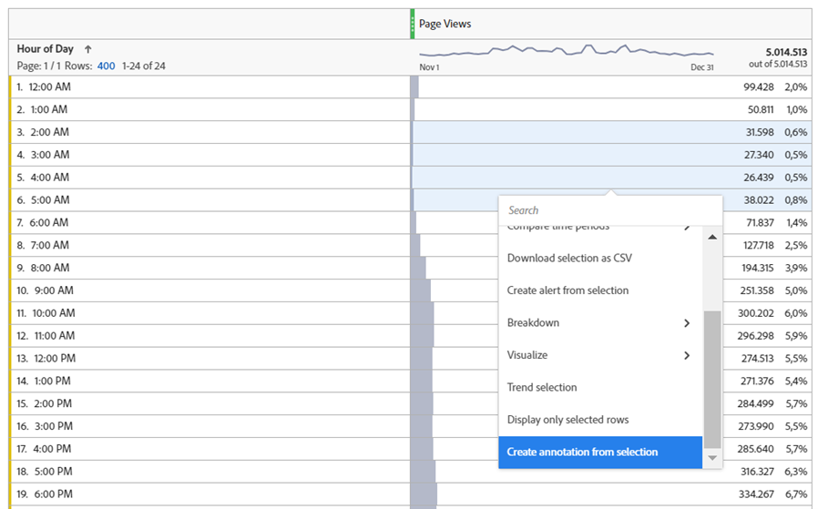

# Desbloquear o insight analítico; aproveitar o potencial das anotações

O componente de dados Anotações é uma das funcionalidades mais simples, mas a longo prazo, uma das mais econômicas em termos de tempo oferecidas no Adobe Analysis Workspace. Diferentemente de qualquer outra funcionalidade no Workspace, ela serve como uma memória histórica narrativa para você e seus colegas usuários do Workspace.

Simplificando, as Anotações são textos de descrição curta que podem ser adicionados aos dados de tendência de data no Adobe Workspace. As anotações oferecem contexto a todos que usam o Analysis Workspace para entender o histórico de dados da sua empresa, ajudam a analisar o desempenho com mais rapidez e dão a todos os seus relatórios uma impressão altamente personalizada.

## Casos de uso

Há várias situações em que as Anotações são particularmente úteis:

- **Outliers (Peaks &amp; Troughs)** - se você souber o motivo dos principais picos e depressões dos dados de tendência, clique com o botão direito do mouse no ponto de dados de exceção e escolha &quot;Anotar seleção&quot; para compartilhar esse conhecimento com todos.

- **Principais campanhas e testes de marketing** - como campanhas e testes de marketing (A/B, multivariado etc.) podem afetar diretamente o tráfego e o desempenho, é um benefício fácil para todos documentar o período dessas campanhas e testes em Anotações.

- **Fatores Externos e Eventos** - qualquer coisa, desde grandes acontecimentos únicos, até ações de concorrentes, novas versões de produtos e eventos globais ou nacionais relevantes, certifique-se de adicionar quaisquer fatores externos relevantes para dados às Anotações.

- **Lacunas e erros** - você deve usar o recurso Alertas para avisá-lo sobre possíveis problemas de coleta de dados, mas até mesmo a equipe mais experiente infelizmente enfrenta alguma forma de erros de coleta de dados ou lacunas temporárias de vez em quando. As anotações são uma ótima maneira de minimizar o impacto, pois permitem que os usuários saibam que os dados estão ausentes ou incompletos.

## Como

Criar e editar anotações é intuitivo e quase autoexplicativo. Clique com o botão direito do mouse em um ponto de dados em uma visualização de tendência de data ou tabela de forma livre e escolha &quot;Anotar seleção&quot; para criar uma anotação ou use a navegação principal para &quot;Componentes > Anotações&quot; para criar e editar anotações.

{width="70%"}{width="30%"}

Para obter todos os detalhes sobre como as anotações funcionam, assista ao [tutorial em vídeo sobre o Experience League](https://experienceleague.adobe.com/pt-br/docs/analytics-learn/tutorials/analysis-workspace/navigating-workspace-projects/annotations-in-analysis-workspace).

## Dicas e truques para começar

Por fim, veja algumas dicas úteis para começar a usar anotações imediatamente.  Usar essas sugestões ajudará a tornar suas anotações eficazes, claras e informativas para todos os usuários.

- **Codificação por cores** - O recurso Anotações permite selecionar entre uma variedade de cores, que aparecem em seus projetos do Workspace para ajudá-lo a diferenciar entre vários tipos de Anotações. Se você medir vários sites ou aplicativos diferentes, poderá escolher uma cor diferente para cada um. Ou talvez uma cor diferente para cada categoria de anotações.

- **Rotulação de Título** - Uma maneira adicional de fornecer aos usuários dicas visuais fáceis sobre uma anotação é rotular o título da anotação. Semelhante à codificação por cores, você pode escolher rótulos diferentes de acordo com como sua organização estrutura os dados, por exemplo, por canal ou nome (ou seja, WEB, APLICATIVO ou TODOS)

- **Escopo** - Ao criar uma anotação, você tem o conjunto completo de dimensões, métricas e limitadores à sua disposição para exibir anotações no contexto adequado. Algumas anotações são relevantes apenas para determinadas dimensões ou métricas, portanto, é possível limitar quando uma anotação é exibida à dimensão ou métrica correspondente.

- **Salvar como** - Depois de criar uma ou duas anotações, você pode reutilizá-las como modelos para criar novas anotações usando a opção de economia de tempo &quot;Salvar como&quot;.

- **Gerenciador de Anotações** - Use a navegação principal para &quot;Componentes > Anotações&quot; para acessar o Gerenciador de Anotações, onde você encontrará funcionalidades mais amplas para criar e, especialmente, editar anotações.

- **Permissões -** Se você não tiver a capacidade de criar Anotações, entre em contato com o administrador que pode permitir a &quot;Criação de Anotações&quot; no Admin Console.

Para obter a documentação detalhada, visite a [Visão geral das anotações](https://experienceleague.adobe.com/pt-br/docs/analytics/analyze/analysis-workspace/components/annotations/overview) e os artigos ao redor.

## Autor

Este documento foi escrito por:

Thomas Edward Buckley, Data Warehouse e Business Intelligence da Miles &amp; More (Lufthansa Group)
