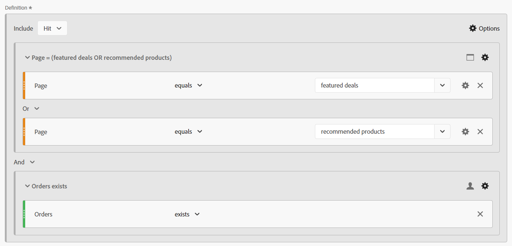
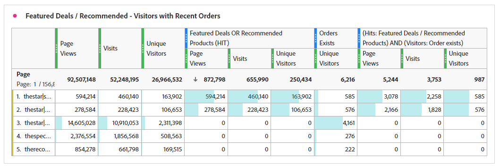
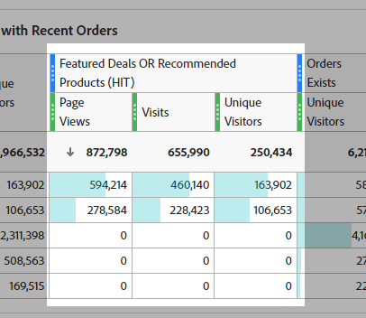
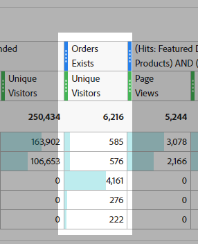
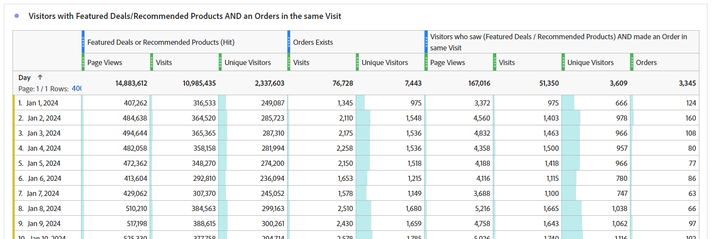
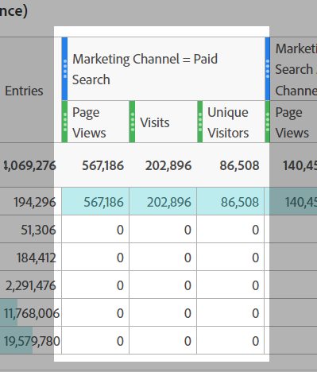

# A mágica por trás da cortina: segmentos complexos: exclusões, containers e atribuição

_Descubra as complexidades da segmentação de dados complexa, explorando exclusões, contêineres e modelos de atribuição. Como a habilidade de um mágico, dominar essas técnicas permite que os analistas executem magia de dados, transformando insights com precisão e fineza._

As cortinas estão abertas, o palco está definido... isso pode não ser um ato mágico de Las Vegas, mas podemos realizar alguns truques incríveis ao construir nossos segmentos.

Dentro deste módulo abordaremos:

- Excluir lógica
- Uso de contêineres
- Modelo de atribuição

## Incluir vs. excluir

Por padrão, todos os contêineres começam como **include** tipo, o que significa basicamente que eles retornam os dados que correspondem aos critérios. No entanto, também é possível alterar o segmento ou os contêineres dentro dos segmentos a serem **excluir** permite rejeitar determinados critérios.

Embora um mágico possa achar sua carta no baralho, é incrível quando esse mágico pode fazer o resto do baralho não existir. Da mesma forma, em excluir segmentos, queremos que os dados indesejados simplesmente desapareçam de nosso conjunto de dados.

Vocês podem estar sentados lá pensando: &quot;Ok, mas eu já tenho as opções &quot;Não é igual&quot; e &quot;Não contém&quot;, então isso não deveria me cobrir?&quot; Infelizmente, a resposta a isso é não... e não se trata apenas de ser capaz de excluir grupos de lógica, sobre um único elemento. Mesmo ao lidar com um único componente, geralmente é necessário usar *exclui* para atingir sua meta.

- **Não contém / Não é igual** - É exatamente como parece, correspondendo a itens que não contêm uma string específica
- **Excluir: o valor contém / é igual a** - Isso vai *excluir* itens que correspondem à sequência de caracteres

À primeira vista, ambos parecem iguais... e em diante **hit** segmentos/contêineres nivelados, você estaria correto, pois eles executarão a mesma ação. No entanto, ao usar **visita** ou **visitante** escopo, você obterá resultados muito diferentes.

**Figura 1: Não contém / não é igual - Escopo da ocorrência**

*Observe que cada ocorrência retorna um valor verdadeiro ou falso e que esses valores são revertidos entre não e excluem.*

- &quot;Value&quot; não contém &quot;Example&quot; (yes), portanto, retorna true e inclui essa ocorrência; da mesma forma, &quot;Example&quot; não contém &quot;Example&quot; (não, ele contém), portanto, retorna false e não inclui essa ocorrência. Basicamente, retorne quaisquer dados que retornem um resultado verdadeiro.
- O &quot;Valor&quot; contém &quot;Exemplo&quot; (não), portanto, retorna falso e não exclui essa ocorrência; da mesma forma, o &quot;Exemplo&quot; contém &quot;Exemplo&quot; (sim), portanto, retorna verdadeiro e exclui essa ocorrência. Basicamente, o retorna dados que não **não** têm um resultado true ou retornam dados que são false para os seus critérios.
- Você pode ver isso no **Hit** , ambos os conjuntos de lógicas retornarão o mesmo conjunto de dados.

**Figura 2: Não contém / não é igual a - Escopo de visitas**

*Como acima, cada ocorrência dentro do **visita**serão avaliados com o mesmo valor verdadeiro / falso. No entanto, o conjunto de dados retornado é o da visita inteira.*

- Em cada ocorrência, &quot;Valor&quot; não contém &quot;Exemplo&quot; (sim), portanto, retorna verdadeiro; da mesma forma, &quot;Exemplo&quot; não contém &quot;Exemplo&quot; (não, ele contém), portanto, retorna falso.
   - Se **qualquer** ocorrência nos retornos de visita **true**, depois o **visita inteira** é retornado.*
   - Se a visita fosse inteiramente composta de ocorrências que continham &quot;Exemplo&quot;, nenhuma ocorrência retornaria &quot;true&quot; e, portanto, essa visita **não ser devolvido** em seu conjunto de dados.
- Novamente, em cada ocorrência, &quot;Exemplo&quot; contém &quot;Exemplo&quot; (sim), portanto, retorna verdadeiro
   - Se **qualquer ocorrência** devoluções **true**, toda a visita será **excluído**
   - Se **todas as ocorrências** no retorno da visita **false**, essa visita será retornada em seu conjunto de dados
- Agora vocês podem ver onde essa lógica começa a divergir. No exemplo acima, há três visitas distintas:
   - Ao usar &quot;Não contém / igual&quot; **dois dos três** as visitas serão retornadas.
   - Ao usar &quot;Excluir contém / é igual a&quot; **somente um** dessas visitas serão retornadas

**Figura 3: Não contém / não é igual a - Escopo de visita**

*Como acima, cada ocorrência feita pelo **visitante**serão avaliados com a mesma lógica verdadeira/falsa. Mas agora estamos observando todas as ocorrências que esse visitante fez, em todas as visitas (dentro do intervalo de datas selecionado).*

- Em cada ocorrência, &quot;Valor&quot; não contém &quot;Exemplo&quot; (sim), portanto, retorna verdadeiro; da mesma forma, &quot;Exemplo&quot; não contém &quot;Exemplo&quot; (não, ele contém), portanto, retorna falso.
   - Se **qualquer** a ocorrência feita pelo visitante retorna **true**, depois o **visita inteira** é retornado.
   - Se o visitante nunca tivesse feito uma ocorrência que contivesse &quot;Exemplo&quot;, nenhuma ocorrência retornaria &quot;true&quot; e, portanto, esse visitante **não ser devolvido** em seu conjunto de dados.
- Novamente, em cada ocorrência, &quot;Exemplo&quot; contém &quot;Exemplo&quot; (sim), portanto, retorna verdadeiro.
   - Se **qualquer ocorrência** devoluções **true**, todo o visitante (e, posteriormente, todas as suas visitas) será **excluído.**
   - Se **todas as ocorrências** no retorno da visita **false**, esse visitante será retornado ao seu conjunto de dados, retornando com sucesso os visitantes que não fizeram &quot;X&quot;.
- Essa é uma extensão da lógica de visita, em que há ainda mais considerações. No exemplo acima, há dois visitantes distintos, com 3 visitas cada:
   - Ao usar &quot;Não contém / igual&quot; **ambos** os visitantes serão retornados, assim como todos **três** de suas visitas (respondendo por 2 visitantes e 6 visitas totais em seus relatórios)
   - Ao usar &quot;Excluir contém / é igual a&quot; **somente um** desses visitantes serão retornados e somente as três visitas associadas a esse visitante serão incluídas (contabilizando 1 visitante e 3 visitas totais em seus relatórios)

>[!TIP]
>
>Essa lógica pode ser complexa, especialmente quando você começa a aninhar contêineres... sempre é uma boa ideia testar em relação a dados de amostra controlados para garantir que seu segmento esteja de fato retornando os dados que você acha que deveria.

### Exemplo 1 de segmento: excluir visitas que fazem uma compra

Neste exemplo, quero direcionar usuários que vieram a um site e vieram *não* fazer uma compra durante a visita (basicamente, desejo excluir as visitas que executaram uma transação; portanto, ficarei com as visitas que não concluíram uma transação)

Para comparar, vamos observar um segmento criado com o uso de &quot;Não existe&quot;:

Observe como a visualização mostra um resultado muito diferente... na verdade, esse segmento retornará 100% das minhas visitas, porque cada visita tem pelo menos uma ocorrência que não inclui a métrica &quot;Pedido&quot;.

Para ilustrar isso mais detalhadamente, vamos comparar os dois segmentos lado a lado:

Primeiro, você pode ver que, apesar da *visita* escopo de nível do segmento, podemos emparelhar o segmento com outras métricas (como exibições de página ou visitantes únicos). O primeiro conjunto de colunas é não segmentado, para mostrar rapidamente que um segmento (não existe) está retornando quase 100% dos dados, mas somente o segmento de exclusão está fazendo o que é necessário.

A coluna mais perceptível são os pedidos, que devem ser imediatamente óbvios de que o contêiner &quot;Não existe&quot; está errado, pois a maioria dos pedidos ainda está sendo retornada.

### Exemplo 2 de segmento: excluir visitantes que fizeram uma compra no período do relatórios

Neste exemplo, quero usar as ideias da amostra anterior (que olhou especificamente para o nível da visita) e expandi-la para encontrar os visitantes que não fizeram uma compra dentro do período do meu relatório.

Esse segmento será muito semelhante ao exemplo acima, quase idêntico, mas o escopo do segmento fará uma grande diferença.

Agora, se compararmos o segmento com escopo de visitante ao segmento com escopo de visita acima, você verá que muito mais dados e muito mais visitas serão excluídos, já que *visitantes que fizeram compras* O também teve visitas em que nenhuma compra foi feita e, portanto, essas visitas também são excluídas, pois fazem parte do ciclo de vida do visitante.

>[!IMPORTANT]
>
>Quando você estiver procurando dados com escopo de visitante, quanto maior o intervalo de tempo do seu relatório, maior será a exclusão, já que muitos visitantes serão fiéis quando retornarem visitantes ao seu site (claro, alguns modelos de negócios verão um impacto maior do que outros)

>[!IMPORTANT]
>
>Embora as diferenças entre visita e visitante possam ser *sutil* (particularmente neste exemplo de dados), elas são lógicas exclusivas que devem ser consideradas. Seus dados podem ser muito diferentes, dependendo do site e dos comportamentos do usuário.

É importante saber exatamente quais dados ou o que *história*, você está tentando dizer com seu relatório. Garantir que suas tabelas e visualizações informem claramente o público-alvo ***o que*** O está sendo mostrado e o uso do modelo de segmento apropriado é essencial para fazer a análise apropriada. Decisões conscientes só podem ser tomadas adequadamente se todos entenderem o que estão olhando.

## Uso de contêineres

Os containers nos fornecem a capacidade de criar &quot;sublógica&quot; dentro da lógica principal do segmento, e um equívoco comum é que o escopo deve ser o mesmo entre o segmento e o container, mas não. Isso nos dá mais liberdade para criar cenários específicos num esquema maior das coisas, para construir uma lógica complexa.

A melhor maneira de pensar sobre contêineres é imaginar cada contêiner sendo uma caixa, e que podemos empilhar caixas (de lógica) dentro de outra caixa, dentro de outra caixa... mas ao contrário das caixas físicas onde cada caixa deve ser menor do que a caixa externa, podemos colocar algo maior dentro se isso nos levar para obter os dados corretos de volta. Pense nisso como um chapéu de mágico, onde o impossível pode caber dentro e nós somos os mágicos dos dados...

### Escopo dos contêineres

Primeiro, vamos analisar rapidamente *container* âmbito de aplicação. Curtir *segmentos s* escopo, você tem seu básico **hit**, **visita** e **visitante** opções de escopo, mas às vezes você também verá algo chamado **grupo lógico** no lugar do visitante (isso só ocorrerá em segmentos sequenciais, e abordaremos esses no próximo artigo).

A adição de contêineres no seu segmento (ou em outros contêineres) pode ser obtida ao acessar o **opções*** (ao aninhar vários itens, tenha cuidado para adicionar ao bloco correto, embora, felizmente, você possa arrastar e soltar contêineres na interface se adicioná-lo ao local errado)

**Figura 1: Adição de um contêiner**

O âmbito de aplicação de um contentor é independente do pai, como já referi, estes *não* tem que combinar, e dependendo do que você quer retornar, você pode precisar desenhar o plano para visualizar totalmente o que você precisa, pelo menos até que você se sente confortável visualizando-o em sua cabeça.

**Figura 2: Escopo do segmento versus escopo do contêiner**

>[!NOTE]
>
>Adobe tem lógica para entender segmentos válidos e inválidos. Eles não forneceriam opções que pudessem *nunca* trabalho... se você vir a opção de usar um contêiner com escopo de visitante em um segmento com escopo de ocorrência, significa que é uma opção válida.

Assim como para os segmentos básicos, quando você começa a construir um segmento complexo com contêineres aninhados, é necessário ter uma ideia clara sobre ***o que*** tipo de dados que você deseja retornar. ***Como*** você planeja usar esses dados? ***Qual*** métricas que você pretende emparelhar com o segmento?

Essas perguntas ajudarão a determinar qual será o escopo do segmento como um todo, esse é o ponto de partida para qualquer segmento.

Apenas porque você planeja emparelhar um segmento com sua métrica de visitantes únicos não significa que o segmento em si deve ser do nível de visitante... longe dele. Um segmento de nível de visitante retornará todos os dados de um visitante... ou seja, todas as visitas, visualizações de página etc... quando um visitante corresponde aos critérios do segmento, ele pode começar a retornar dados do *passado* para este visitante (desde que esteja dentro do intervalo de datas do seu espaço de trabalho).

>[!IMPORTANT]
>
>Mesmo ao planejar emparelhar um segmento com a métrica de visitantes únicos, isso *não significa* que o segmento deve ter o escopo do visitante automaticamente... Este equívoco *pode* criar resultados inflados e incorretos.

Então, eu falei muito sobre os conceitos de como selecionar o escopo adequado, mas não forneceu exemplos ou especificidades que realmente ajudarão você... então vamos nos aprofundar nisso agora com alguns exemplos reais de caso de uso. Dizem que um mágico nunca revela seus segredos, mas isso não é bem verdade. Dentro do mundo mágico, as técnicas e o trabalho &quot;por trás da cortina&quot; são muitas vezes partilhados com os pares, permitindo-lhes construir e melhorar a ilusão, e é isso que pretendo fazer... para abrir as portas para as possibilidades que vos esperam.

### Exemplo de segmento 3: exibições em páginas específicas de visitantes que fizeram um pedido recente (dentro do período do relatório)

Nesse cenário, quero retornar apenas um conjunto de páginas específicas que foram acessadas por compradores recentes (observe que ainda posso emparelhar isso com visitas ou visitantes únicos, mesmo que o segmento em si esteja em um escopo de ACESSO).

Esse tipo de cenário é bom para observar se tenho compradores olhando para páginas específicas em um site, páginas que podem não estar explicitamente conectadas a um evento específico.

Meu exemplo vai para as páginas de &quot;Ofertas em destaque&quot; e &quot;Produtos recomendados&quot;. Atualmente, vamos manter a lógica simples e não entrar na segmentação sequencial (pelo menos ainda não, mas abordaremos uma lógica mais complexa como essa em um artigo futuro).

Outra questão é **por que** estamos recuando por acertos? Tecnicamente, posso puxar por Visitas ou Visitantes aqui, mas também posso querer olhar para essas páginas específicas por **Exibições de página (para o conjunto de páginas específico) por visita** ou **Visualizações de página (para o conjunto específico) por visitante**, este escopo me dá a flexibilidade para realizar esta matemática específica. Como essas ocorrências podem ser facilmente emparelhadas com visitas ou visitantes únicos para determinar o número de visitas ou visitantes que visualizam essas páginas, optarei pelo segmento mais flexível que posso usar para todos os cenários.

Primeiro, para comparação, aqui está um segmento baseado em HIT simples para as páginas específicas.

Agora, vamos integrar a complexidade:

Você observará que não estou usando somente vários contêineres, mas que estou misturando o escopo desses contêineres. O Segmento como um todo está no nível da OCORRÊNCIA, mas também procuro VISITANTES que fizeram um pedido.

Vamos passar um tempo para desempacotar isto, já que há muita coisa acontecendo.

Primeiro, em vez de mostrar um detalhamento diário, estou mostrando um detalhamento de página, pois acho que isso ajudará a ilustrar melhor os dois segmentos.

 As três primeiras colunas (Exibições de página, visitas e visitantes únicos) não estão segmentadas e, portanto, mostram todas as páginas do site. Observe que não incluí pedidos aqui, pois os pedidos são rastreados em uma ação e, portanto, não fazem parte do escopo da dimensão de página.

 Em seguida, estou mostrando o resultado do segmento simples, observando apenas **ocorrências** nas duas páginas especificadas. Você notará que as outras páginas no detalhamento resultam em 0, como esperado.

 Agora, aqui está uma pequena dica de bônus, antes de mostrar o resultado do segmento avançado, usei outro segmento simples de &quot;Pedidos existem&quot; (em um escopo de nível de HIT), e eu o emparelhei com visitantes únicos. Isso me retornará o total de UVs que fizeram pedidos no período do meu relatório, bem como os UVs que atingem cada uma dessas páginas... isso ajudará a ilustrar melhor o próximo conjunto de colunas.

 O conjunto final de colunas é empilhado com meu segmento complexo. As UVs gerais com pedidos correspondem ao segmento simples &quot;Pedidos existem&quot; em cada página, mas você observará que o total é significativamente diferente; como esse conjunto de dados restringe explicitamente o conjunto de dados somente aos visitantes que fizeram pedidos E acessaram as páginas, estou explicitamente interessado em.

### Exemplo de segmento 4: visitas que acessam ofertas em destaque OU produtos recomendados E fazem um pedido na mesma visita

O exemplo acima mostrou como você pode adicionar um contêiner de escopo maior (ou seja, visitante) dentro de um contêiner de escopo menor (ou seja, ocorrência, para que não seja surpresa o fato de você poder adicionar contêineres de ocorrência dentro de segmentos com escopo de visitante ou visita.

Usando algumas das mesmas páginas que estávamos olhando anteriormente, agora só nos preocupamos em receber de volta os visitantes que fizeram as ofertas em destaque OU a página de produtos recomendados E fizemos um pedido na mesma visita.

Este segmento mescla todos os três escopos. O nível superior do segmento é visitante, portanto, isso garantirá que TODAS as ocorrências de todas as visitas sejam retornadas para o visitante correspondente. Dentro disso, adicionamos um contêiner de escopo de visita, isso vai garantir que o visitante tenha tido pelo menos uma visita que corresponda aos critérios específicos de fazer um pedido E visitar páginas específicas. Adicionamos um contêiner de escopo de ocorrência para as próprias páginas, para que possamos usar a lógica OU para procurar a página de ofertas em destaque OU a página de produtos recomendados.

O benefício deste segmento com escopo de visitante é que ele retornará **TODOS** visitas dos visitantes que correspondem a esses critérios, portanto, esse segmento será bom se eu quiser ver os comportamentos em visitas anteriores que antecedem essa combinação e as ações desses visitantes após esse cenário.

Aqui estou comparando ocorrências em ofertas em destaque/conteúdo recomendado com pedidos no segmento complexo em que o pedido e uma das páginas especificadas existem na mesma visita. O segmento complexo é onde os dois primeiros segmentos se cruzam; mas como é o escopo do visitante, todas as outras visitas desses visitantes também serão retornadas.

## Modelo de atribuição

A modelagem de atribuição em uma definição de segmento se refere principalmente a dimensões com expiração sem ocorrência, de modo que props (que são sempre um nível de ocorrência) não são realmente um bom candidato. Suas eVars, canais de marketing etc. no entanto, são realmente para o que essas configurações são projetadas.

Antes de analisarmos o segmento, devemos fazer uma rápida análise de como a modelagem de atribuição funciona em um exemplo simples.

Digamos que temos duas eVars, uma delas está definida para visitar o vencimento (eVar 1) e outra está definida para um vencimento de 30 dias (eVar 2). Para simplificar, vamos rastrear uma campanha interna (icid).

**Visita 1**

- Página A
   - **EVAR 1** não está definido
   - **EVAR 2** não está definido
- Clique no banner promocional com ?icid=promo-banner no URL
- Página B
   - **EVAR 1** e **EVAR 2** são definidos como &quot;banner promocional&quot;
   - **Instância de eVar 1** é acionado
   - **Instância de eVar 2** é acionado
- Página C
   - Ambos **EVAR 1** e **EVAR 2** mantenha o valor &quot;banner promocional&quot;
   - Nenhuma das métricas de instância para eVars é acionada, pois ambas as eVars estão usando valores persistentes

**Visita 2**

- Página D
   - **EVAR 1** não está definido com nenhum valor e nenhum **Instância de eVar 1** é acionado
   - **EVAR 2** mantém o valor &quot;banner promocional&quot; devido à expiração de 30 dias
   - **Instância de eVar 2** não é acionado, pois o valor é persistente e não está definido
- Clique na promoção do painel lateral com ?icid=promo-side-rail no URL
- Página E
   - **EVAR 1** e **EVAR 2** são definidos como &quot;promo-side-rail&quot;
   - **Instância de eVar 1** é acionado
   - **Instância de eVar 2** é acionado
- Página F
   - Ambos **EVAR 1** e **EVAR 2** mantenha o valor &quot;promo-side-rail&quot;
   - Nenhuma das métricas de instância para eVars é acionada, pois ambas as eVars estão usando valores persistentes

Atualmente, este é o resultado esperado dessas duas visitas:

<table><tr><th colspan="1" valign="top"></th><th colspan="1" valign="top"></th><th colspan="1" valign="top"><b>Page Views</b></th><th colspan="1" valign="top"><b>Visitas</b></th><th colspan="1" valign="top"><b>Instância de eVar 1</b></th><th colspan="1" valign="top"><b>Instância de eVar 2</b></th></tr>
<tr><td colspan="1" valign="top"></td><td colspan="1" valign="top"></td><td colspan="1" valign="top">6</td><td colspan="1" valign="top">2</td><td colspan="1" valign="top">2</td><td colspan="1" valign="top">2</td></tr>
<tr><td colspan="1" rowspan="7" valign="top">Página</td><td colspan="1" valign="top"></td><td colspan="1" valign="top">6</td><td colspan="1" valign="top">2</td><td colspan="1" valign="top">2</td><td colspan="1" valign="top">2</td></tr>
<tr><td colspan="1" valign="top">Página A</td><td colspan="1" valign="top">1</td><td colspan="1" valign="top">1</td><td colspan="1" valign="top">0</td><td colspan="1" valign="top">0</td></tr>
<tr><td colspan="1" valign="top">Página B</td><td colspan="1" valign="top">1</td><td colspan="1" valign="top">1</td><td colspan="1" valign="top">1</td><td colspan="1" valign="top">1</td></tr>
<tr><td colspan="1" valign="top">Página C</td><td colspan="1" valign="top">1</td><td colspan="1" valign="top">1</td><td colspan="1" valign="top">0</td><td colspan="1" valign="top">0</td></tr>
<tr><td colspan="1" valign="top">Página D</td><td colspan="1" valign="top">1</td><td colspan="1" valign="top">1</td><td colspan="1" valign="top">0</td><td colspan="1" valign="top">0</td></tr>
<tr><td colspan="1" valign="top">Página E</td><td colspan="1" valign="top">1</td><td colspan="1" valign="top">1</td><td colspan="1" valign="top">1</td><td colspan="1" valign="top">1</td></tr>
<tr><td colspan="1" valign="top">Página F</td><td colspan="1" valign="top">1</td><td colspan="1" valign="top">1</td><td colspan="1" valign="top">0</td><td colspan="1" valign="top">0</td></tr>
</table>

<table><tr><th colspan="1" valign="top"></th><th colspan="1" valign="top"></th><th colspan="1" valign="top"><b>Page Views</b></th><th colspan="1" valign="top"><b>Visitas</b></th><th colspan="1" valign="top"><b>Instância de eVar 1</b></th></tr>
<tr><td colspan="1" valign="top"></td><td colspan="1" valign="top"></td><td colspan="1" valign="top">4</td><td colspan="1" valign="top">2</td><td colspan="1" valign="top">2</td></tr>
<tr><td colspan="1" rowspan="3" valign="top">eVar1</td><td colspan="1" valign="top"></td><td colspan="1" valign="top">4</td><td colspan="1" valign="top">2</td><td colspan="1" valign="top">2</td></tr>
<tr><td colspan="1" valign="top">banner promocional</td><td colspan="1" valign="top">2</td><td colspan="1" valign="top">1</td><td colspan="1" valign="top">1</td></tr>
<tr><td colspan="1" valign="top">painel lateral promocional</td><td colspan="1" valign="top">2</td><td colspan="1" valign="top">1</td><td colspan="1" valign="top">1</td></tr>
</table>

<table><tr><th colspan="1" valign="top"></th><th colspan="1" valign="top"></th><th colspan="1" valign="top"><b>Page Views</b></th><th colspan="1" valign="top"><b>Visitas</b></th><th colspan="1" valign="top"><b>Instância de eVar 2</b></th></tr>
<tr><td colspan="1" valign="top"></td><td colspan="1" valign="top"></td><td colspan="1" valign="top">5</td><td colspan="1" valign="top">2</td><td colspan="1" valign="top">2</td></tr>
<tr><td colspan="1" rowspan="3" valign="top">eVar2</td><td colspan="1" valign="top"></td><td colspan="1" valign="top">5</td><td colspan="1" valign="top">2</td><td colspan="1" valign="top">2</td></tr>
<tr><td colspan="1" valign="top">banner promocional</td><td colspan="1" valign="top">3</td><td colspan="1" valign="top">2</td><td colspan="1" valign="top">1</td></tr>
<tr><td colspan="1" valign="top">painel lateral promocional</td><td colspan="1" valign="top">2</td><td colspan="1" valign="top">1</td><td colspan="1" valign="top">1</td></tr>
</table>

Agora, vamos ver onde você pode definir a atribuição no seu segmento.

**Figura 4: Modelo de atribuição**

*O ícone de engrenagem na dimensão é onde você pode definir a atribuição. Cada opção tem informações disponíveis ao passar o mouse sobre o &quot;?&quot; ícone. Basicamente:*

- O comportamento padrão retornará todas as instâncias do eVar em que o valor é definido (especificamente ou por meio da atribuição definida)
- A instância retornará apenas a dimensão em que o valor é explicitamente definido (ou seja, nas ocorrências em que a &quot;Instância de eVar&quot; é acionada)
- A instância de não repetição só retornará a primeira vez que o valor da dimensão for definido (ou seja, enquanto não for abordado no exemplo acima, imagine que o usuário clicou no banner promocional várias vezes, isso também incrementaria a &quot;Instância de eVar&quot; para cada vez que o banner fosse clicado, essa configuração só tomaria a primeira instância exclusiva de &quot;banner promocional&quot; e ignoraria qualquer contagem subsequente desse banner)

### Exemplo de segmento 5: &quot;Pesquisa paga&quot; do canal de marketing em relação às instâncias diretas da pesquisa paga

Como todos sabemos, os canais de marketing têm um modelo de atribuição longo (30 dias por padrão, mas isso pode ser personalizado para suas próprias necessidades) e, uma vez definido, o canal de marketing não será substituído por visitas &quot;diretas&quot; subsequentes ao site, para que seus drivers específicos recebam a atribuição de conversão. No entanto, às vezes é necessário ver especificamente a ***entradas*** no seu site por um canal de marketing específico e por entradas, quero dizer que você precisa ver quando o canal de marketing é definido especificamente com base nas suas regras de processamento de marketing.

Vamos mudar as coisas e começar observando as comparações, então vamos analisar os segmentos.

 As primeiras 4 colunas não estão segmentadas e devem ser fáceis de entender. Observe que *&quot;Entradas&quot;* é basicamente um valor calculado com base em onde os visitantes iniciam a sessão. Eu o adicionei aqui para mostrar que isso não retorna as informações que estamos procurando, pois os usuários podem entrar no site por meio de vários canais de marketing (por meio da análise de redes sociais, de pesquisas, clicando em emails de marketing etc.). tudo dentro da mesma visita/sessão).

 O próximo conjunto de colunas usa um &quot;Segmento de ocorrência padrão&quot;, basicamente olhando as ocorrências em que o canal de marketing é &quot;pesquisa paga&quot;. No entanto, isso retornará TODAS as ocorrências com base na atribuição do Canal de marketing, não isolará os click-throughs de &quot;Pesquisa paga&quot; reais. Portanto, isso não retornará os dados de que precisamos.

 Agora, os próximos dois conjuntos de dados parecem idênticos e, de fato, eles retornarão os mesmos dados de duas maneiras diferentes. Mas agora eu estou especificamente olhando para o *instâncias* onde o canal de marketing foi **set** para &quot;Pesquisa paga&quot;.

Isso pode ser feito de duas maneiras:

Primeiro, é usando a atribuição de dimensão &quot;padrão&quot; e, em conjunto com a métrica &quot;Instância de canal de marketing&quot; específica (como uma *existe* lógica):

Ou, em segundo lugar, para um segmento mais simples, você pode alterar a atribuição para &quot;Instância&quot;. Observe que o nome da dimensão mudará de &quot;Canal de marketing&quot; para &quot;Canal de marketing (instância)&quot;.

## Tudo junto na prática

Como qualquer bom mágico, podemos começar com cada truque individual, construindo o público à medida que vamos, levando-os ao &quot;prestígio&quot; final. Aqui é onde nós realmente brilhamos, pegando todos os pequenos truques, e os enrolamos em um grande final. Pegando as partes aparentemente desconectadas do truque, e mostrando que, de fato, todos eles trabalham juntos para formar um todo coeso.

### Exemplo de segmento 6: visitantes que fizeram um pedido durante uma visita com instância social paga e excluindo visitantes que estão inscritos em qualquer informativo

Isso permitirá identificar os visitantes que fizeram uma compra ativamente durante uma visita de uma campanha de mídia social, mas não se inscreveram nos boletins informativos. Isso permitirá que nossa equipe de marketing veja o grupo potencial de usuários que tentarão converter para boletins informativos e emails de marketing.

## Final

Existem tantas maneiras de combinar a lógica para entrar em cenários muito detalhados, que eu posso apenas arranhar a superfície das possibilidades.

Como qualquer grande mágico, o verdadeiro poder está em inspirar a geração que está chegando a construir sobre as noções básicas, para re-imaginar os aprendizados em algo novo e maravilhoso! Estou ansioso para ver o que todos vocês pensam!

## Autor

Este documento foi escrito por:

Jennifer Dungan, gerente de otimização de análise da Torstar

Especialista em Adobe Analytics
