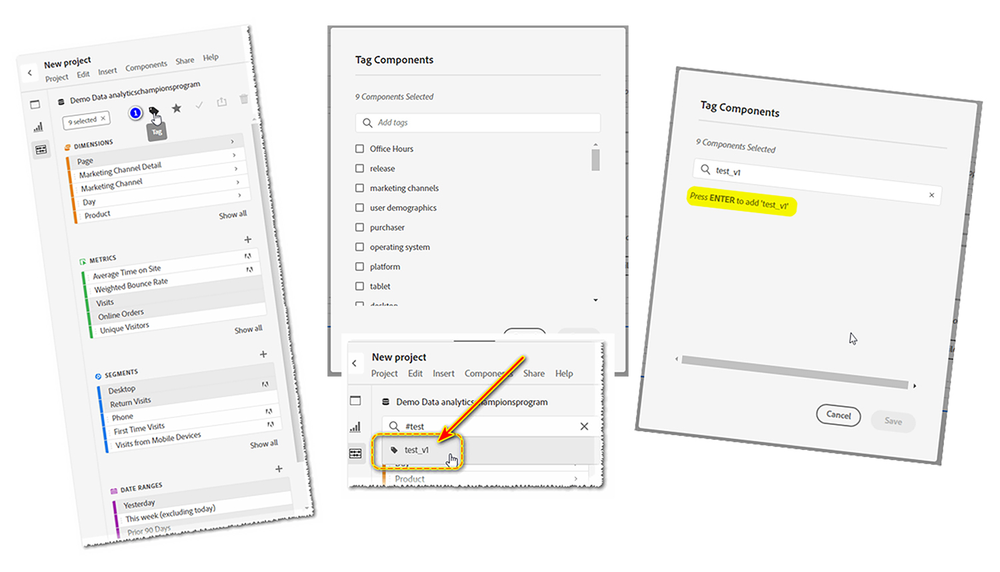
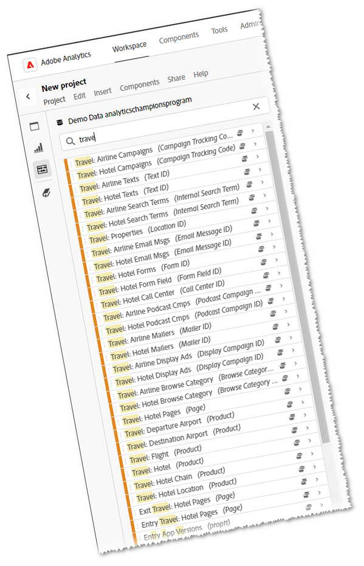
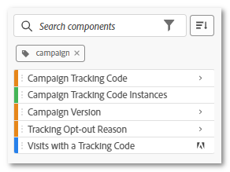

# Tags - seu assistente pessoal

_Descubra como o #TAGS pode simplificar suas análises digitais, atuando como seu assistente pessoal para encontrar o que você precisa com eficiência. Jeff Bloomer, Adobe Analytics Champion, compartilha insights especializados sobre como maximizar o potencial da ferramenta para o seu benefício._

Todos se lembram de jogar um bom jogo de tags ou até mesmo nos escondermos e procurarmos, quando éramos crianças, certo?

A melhor parte foi quando éramos aqueles que voltavam à base (tag) ou ficavam escondidos por mais tempo (hide and seek) até ouvirmos alguém gritar, &quot;Olly Olly oxen free!&quot; (&quot;Todos vós, todos vós, de graça&quot;, derivado do alemão: &quot;alle alle auch sind frei!&quot;).  O que, em última análise, significava que todos os outros tinham chegado à base, foram encontrados, ou alguém foi marcado &quot;ele&quot;, e ainda estávamos livres para jogar outra rodada!

A parte importante é se o jogo foi tag ou ocultar e buscar, estávamos jogando uma atividade divertida onde todos foram encontrados de novo e de novo.

Quando nos voltamos para o nosso trabalho diário, a procura de coisas parece tornar-se muito menos aventureira e muito mais tediosa. Mas não precisa ser assim se estivermos dispostos a colocar apenas um pouquinho de trabalho no front end.  Uma frase bem conhecida pela minha família é, &quot;A maior parte da dor é autoinfligida.&quot; No entanto, embora possa parecer um pouco antiquado nestes dias, há uma frase mais famosa que também é altamente relevante nesta situação: &quot;Um ponto no tempo economiza nove.&quot; - Benjamin Franklin

Agora que tenho a sua atenção, deixe-me começar fazendo uma pergunta:

Quantos de vocês fizeram isso?  Você começou a procurar por uma **dimensão**, **intervalo de datas**, **segmento** ou **métrica calculada** e ficou inundado com essa lista gigante (veja a **Figura 1**) de tudo o que você NÃO deseja.  O ***Analysis Workspace*** acha que está tentando ser útil, mas, na verdade, ele conseguiu apenas não o ser.

*Figura 1 - Pesquisar por &quot;ano&quot;*

Melhor ainda, você criou alguns *novos* **intervalos de datas** e **segmentos**. Por serem &quot;tão novos&quot;, você deve achar que pelo menos esses itens são rápidos e fáceis de encontrar na próxima vez que entrar no ***Adobe Workspace***. Estou certo?

Odeio estourar sua bolha, mas tente deixar o ***Adobe Analytics*** depois que você acabou de criar todos os seus novos &quot;amiguinhos&quot;, e quando você voltar, a maioria deles simplesmente fugiu.  Se você tiver sorte, *talvez* um deles ficou para trás para esperar por você, mas o resto já está longe e brincando de esconde-esconde.

## Reescrita do livro de regras

Então, esse é o jogo desde o primeiro dia, mas e se pudéssemos mudar as regras?

E se pudéssemos criar nosso próprio assistente pessoal para mudar essas regras para sempre?

Sério, o que estamos falando aqui, é TAGS!  Isso mesmo!!  É nosso amigo, a hashtag, antes conhecida como &quot;número&quot; e &quot;sinal da libra&quot;, como vimos em nossos telefones.  Aqueles de nós músicos até chamam isso de &quot;afiado&quot;.

Para aqueles que *realmente* precisam de um lembrete, ele tem esta aparência: **#**

De qualquer forma, o motivo pelo qual estamos falando sobre **#tags** é porque eles são adicionados àquele &quot;balde opcional&quot; de &quot;coisas chatas e tediosas, chatas e chatas&quot; que todo mundo tende a ignorar (como Descrições), porque estamos todos com tanta pressa de criar as coisas mais importantes como, oh, não sei -

- Relatórios do Workspace
- Segmentos
- Métricas calculadas
- Intervalos de datas

Encare isso, pessoal!  Você escolhe isso, nós vimos e ouvimos todas as desculpas para por que eles são ignorados:

&quot;Ah, ei, mas isso é fácil.  Sempre posso voltar mais tarde e apenas atualizar essas coisas em alguns intervalos para almoço, ou talvez até mesmo enquanto estou sentado em uma conferência e *obter tudo em ordem*&quot;, disse todo mundo que NUNCA FEZ.

## O que há na caixa de ferramentas

**Adobe** fez até mesmo de WE THE PEOPLE o serviço de criar um conjunto selecionado de #TAGS pronto para uso, porque, bem... eles tiveram que nos começar em algum lugar.  Vou fornecer algumas advertências adicionais em apenas um pouco, mas o que estou demonstrando primeiro lhe dará o maior retorno pelo seu investimento!

Antes de criar qualquer uma das suas, o que você precisa saber primeiro é como pesquisar por **tags** existentes:

Se você estiver em um projeto novo ou existente, basta ir para a barra de pesquisa de componentes, digitar um #hashtag, juntamente com um desses termos principais (basta assistir ao vídeo), e pressionar ENTER; ou simplesmente começar a rolar até encontrar um termo reconhecível.

PRIMEIRA ADVERTÊNCIA: algo para ter em mente é, se você se mantiver fiel às convenções de nomenclatura apropriadas quando começar a criar suas *próprias* tags, praticamente a cada *tag com maiúsculas* que você vir *deveria*, e serei cuidadoso com essa palavra &quot;deveria&quot;, ser um **Adobe**, item marcado como pronto para uso.  Ou seja, verifique se todas as marcas criadas estão em **minúsculas**.

## Criar seu próprio assistente pessoal

Agora, vamos voltar ao que eu disse sobre um &quot;assistente pessoal&quot; anteriormente.  E se disséssemos que você poderia começar a selecionar alguns dos seus componentes favoritos existentes e depois torná-los os ÚNICOS que você vê?

1. Se você começar a selecionar vários componentes (CTRL+CLIQUE COM O BOTÃO ESQUERDO), você notará que alguns ícones aparecerão na parte superior.  Um deles será o ícone TAG.
1. Clique nele e, em seguida, a caixa de diálogo TAGs será aberta, onde você poderá exibir as tags existentes associadas a esses componentes.
1. É a partir desta tela que você pode atribuir quaisquer **tags adicionais/novas** que desejar neste momento.  (Exemplo: **test\_v1**)
1. Para adicionar uma NOVA marca a qualquer componente, basta pressionar **ENTER** no teclado antes de clicar no botão SALVAR.
1. Em seguida, ao atribuir sua nova TAG, você pode pesquisá-la inserindo hashtag(#) e sua nova TAG.

Perdoe o trocadilho, mas &quot;#tag, você é isso!&quot;  Você acabou de salvar-se muito menos busca no futuro!  Agora você pode ver onde sua diligência e trabalho duro finalmente entrarão em jogo.

## Colocando seu assistente pessoal para trabalhar

Digamos que trabalhemos no **setor de viagens** e estamos reunindo um relatório para seu **horário comercial principal**.  Se fôssemos começar a realizar uma pesquisa apenas sobre o termo &quot;VIAGEM&quot;, podemos obter muito mais resultados do que podemos precisar.  Na verdade, se apenas extraíssemos um **Workspace** contendo metade dos resultados necessários, os componentes ainda não permaneceriam prontamente disponíveis.

No entanto, se durante todo o nosso trabalho diário estivemos marcando regularmente nossos **segmentos**, **métricas** e outros **componentes** relevantes à medida que avançamos e, talvez, criando apenas alguns novos no momento em que criamos nosso novo **espaço de trabalho**, demonstramos seriamente como podemos reescrever o manual de regras a nosso favor!

Nesse caso, criei um #tag simples para todos esses itens chamados: #core.

À medida que você continua fazendo essa parte de seus hábitos de trabalho e aprimora suas habilidades para fazer isso repetidamente, você perceberá que usar #tags se tornará mais como ter seu próprio assistente pessoal.

Quer mais exemplos reais? Considere estes:

1. Por exemplo, que tal uma maneira fácil de encontrar seus **segmentos** e seus **intervalos de datas** para **todos os trimestres** em **2023**?

   

   *Uma dica extra*: este pequeno quadrado à direita permitirá que você altere sua ordem classificada para *alfabética*!

1. É claro que todos usam **códigos de rastreamento de campanha** até certo ponto.  Se você quiser manter uma visão clara de apenas *seus* brinquedos, considere adicionar **#tag** s apenas aos itens principais que você realmente precisa ver e filtrar todos os outros ruídos:

## Agora vá lá e brinque!

Claro, esconde-esconde era divertido quando criança, mas agora somos adultos.  Não temos tempo para estar constantemente procurando as coisas importantes, então certifique-se de fazer um favor a si mesmo e não perca mais tempo lutando contra a ferramenta.  Reescreva as regras e faça a ferramenta funcionar para você.

### Tag, é você!

## Autor

Este documento foi escrito por:

**Jeff Bloomer**, gerente, Digital Analytics na Kroger Personal Finance

Adobe Analytics Champion
